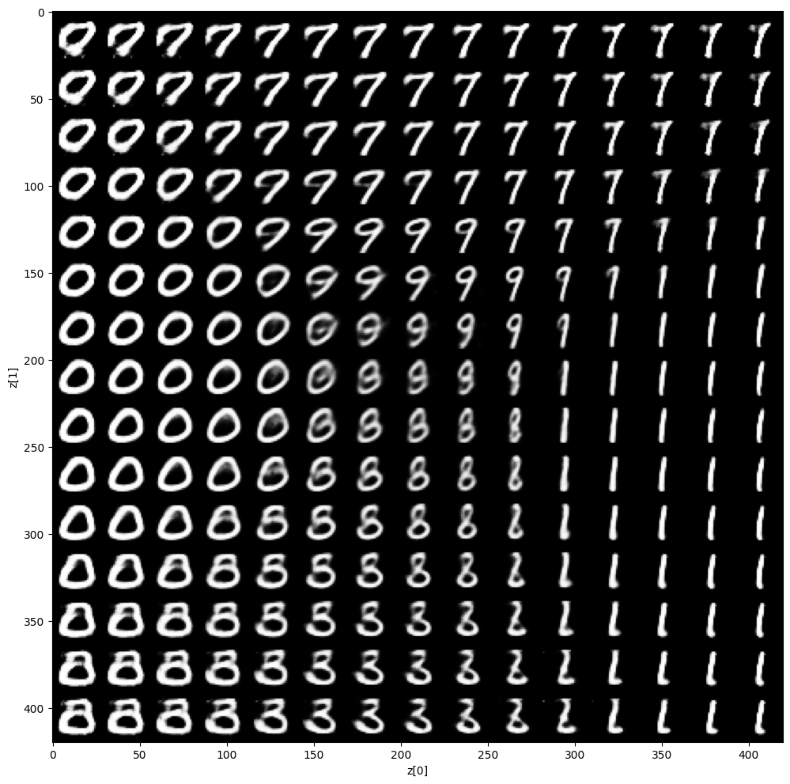

# Beta-VAE-MNIST-Latent-Analysis

This repository implements a **Beta-Variational Autoencoder (Beta-VAE)** trained on the MNIST dataset for unsupervised latent space
learning and analysis. The project showcases latent representation learning, visualization, and clustering of handwritten digits
without labels.

---

## Features

- **Non-Convolutional Beta-VAE** architecture with fully connected layers.
- Customizable β-schedule for balancing reconstruction and KL divergence losses.
- Training pipeline with latent space visualization before and after training.
- KMeans clustering and cluster label relabeling for latent codes.
- t-SNE projection of learned latent embeddings.
- Plotting functions to visualize reconstructed and generated digit samples.

---


## Project Structure

```bash
   Beta-VAE-MNIST-Latent-Analysis/
            ├── demo_script.py              # Main training script
            ├── demo.ipynb                  # Interactive Colab notebook
            ├── model.py                    # Beta-VAE model definition
            ├── utils.py                    # Loss, training loop, plotting, evaluation
            ├── requirements.txt            # Python dependencies
            ├── loss.txt                    # Training logs per epoch
            ├── samples/                    # Folder with saved generated images
            └── README.md                   # Project documentation (this file)
```

---

## Getting Started

### Requirements

```bash
 Install dependencies with:

    pip install -r requirements.txt
    
```
 ### Running the Demo:
 ```bash
     python demo_script.py
     jupyter notebook demo.ipynb
     
```
---

## Training Results

The model was trained for 30 epochs with a linear β schedule increasing from 0 to 1.0.
Below are selected metrics across epochs illustrating the loss components and gradient norms during training.


    | Epoch | β     | Total Loss | Recon Loss | KL Divergence | Grad Norm |
    | ----- | ----- | ---------- | ---------- | ------------- | --------- |
    | 1     | 0.000 | 135.11     | 121.17     | 13.93         | 67.79     |
    | 5     | 0.444 | 106.31     | 88.33      | 17.97         | 96.41     |
    | 10    | 1.000 | 102.74     | 84.32      | 18.41         | 115.49    |
    | 15    | 1.000 | 101.04     | 82.40      | 18.63         | 127.76    |
    | 20    | 1.000 | 99.98      | 81.19      | 18.79         | 137.04    |
    | 25    | 1.000 | 99.17      | 80.28      | 18.89         | 143.10    |
    | 30    | 1.000 | 98.64      | 79.65      | 18.99         | 149.48    |


---


---
## Qualitative Results

### Latent Space Distribution Before and After Training


---

### KMean Clustering Of Latent Space And t-SNE viz:


---

### Confusion Matrix


---

### Digits Generated After Training



---
## Conclusion

This project demonstrates the implementation and analysis of a Beta-Variational Autoencoder (Beta-VAE) trained on the MNIST dataset.
By incorporating a tunable β parameter, the model effectively balances reconstruction fidelity and latent space regularization, leading
to more disentangled and interpretable latent representations. The linear β scheduling strategy helped gradually introduce the KL divergence
penalty, stabilizing training and improving convergence.

The latent space learned by the Beta-VAE exhibited meaningful clustering behavior, as confirmed by K-means clustering and t-SNE visualization.
These results highlight the model’s capability to uncover the underlying structure in the data, which can be beneficial for downstream
tasks such as semi-supervised learning and generative modeling.

Overall, this work validates Beta-VAE as a powerful tool for learning compact, disentangled representations from complex data, opening
pathways for further exploration in representation learning and unsupervised clustering.

---
