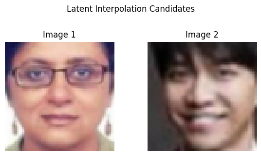
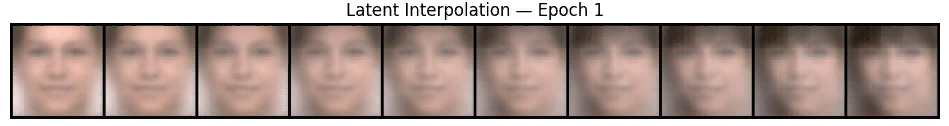
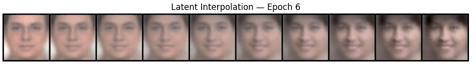
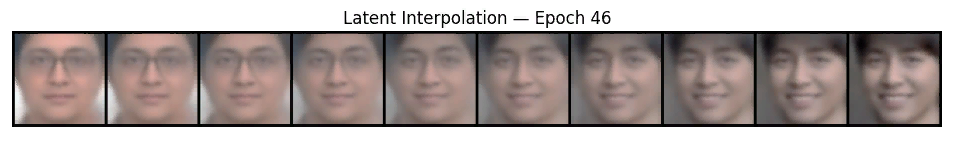
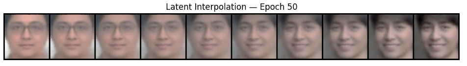
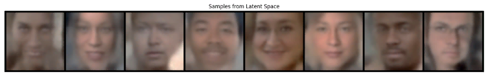
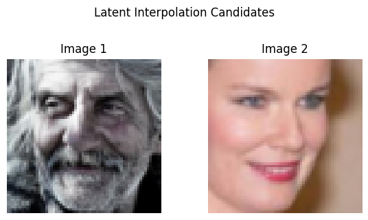
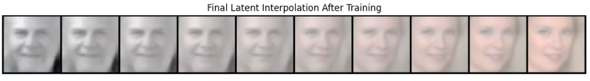

# face-morph-vae

A PyTorch implementation of a Variational Autoencoder (VAE) trained on the UTKFace dataset for face morphing and latent
space interpolation. The model learns compact latent representations enabling smooth transitions between faceimages.

---

## Motivation

Face morphing is widely used in computer vision and graphics, with applications in entertainment and biometrics.
Variational Autoencoders provide a powerful way to learn meaningful latent spaces that support smooth interpolation
and new face generation. This project builds a convolutional VAE tailored for UTKFace images to generate realistic face
reconstructions and latent morphs.

## Features

- Convolutional VAE with residual decoder blocks  
- Training on 64x64 RGB UTKFace images  
- Latent space interpolation between faces  
- Gradient clipping and learning rate scheduling for stable training  
- Visualization of reconstructions, samples, and morphs  

## Setup
---

##  Project Structure

```bash

    fashion-mnist-vae-Vs-ae-demo/
        │
        ├── model.py             # VAE model definitions
        ├── utils.py             # Training, loss, plotting functions
        ├── demo_script.py       # Main training script
        ├── demo.ipynb           # Jupyter notebook version
        ├── requirements.txt     # Dependencies
        ├── README.md            # This file
        
```
---


## Getting Started

### Requirements

```bash
 Install dependencies with:

    pip install -r requirements.txt
    
```
 ### Running the Demo:
 ```bash
     python demo_script.py
     jupyter notebook demo.ipynb
     
```
---

## Training Summary

Training Progress report samples

| Epoch | Train Loss | Validation Loss | Grad Norm | Time (min) |
|-------|------------|-----------------|-----------|------------|
| 1     | 117.5692   | 112.7499        | 50.0000   | 0.625      |
| 11    | 109.8497   | 110.1079        | 50.0000   | 3.095      |
| 21    | 107.4789   | 107.7961        | 50.0000   | 3.119      |
| 41    | 107.0059   | 107.4871        | 50.0000   | 3.119      |
| 50    | 108.6323   | 109.1831        | 50.0000   | 2.580      |


Below we show images generated 

### During training we used the following two images to monitor face-morphing

---









---

### After training The Model: Image Reconstruction Capability is shown below

---
![Reconstruct Images] (reconstruct.png)

---

###Interpolation of Above Shown Original Images



---

### After training The Model: Face-Morphing of Two images

---




---


## Conclusion

In this project, we successfully trained a Variational Autoencoder (VAE) on the UTKFace dataset to perform face morphing.
The model learned meaningful latent representations of facial images, enabling smooth interpolation and realistic face
reconstructions.

Training showed stable convergence with decreasing loss values and controlled gradient norms, confirming effective optimization.
The qualitative results demonstrate that the model can generate convincing face reconstructions and interpolate between
faces in latent space.

This work establishes a solid foundation for face generation and morphing applications. Future improvements could include
conditioning on facial attributes, exploring more advanced architectures, and increasing image resolution for enhanced
realism.

Overall, the project highlights the potential of VAEs in generative modeling for facial image analysis.

---
