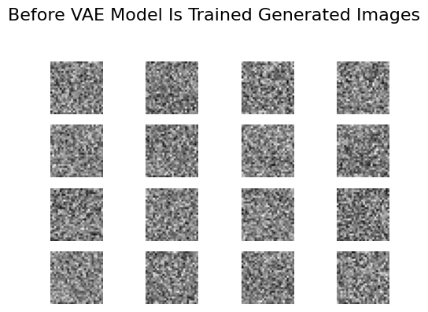
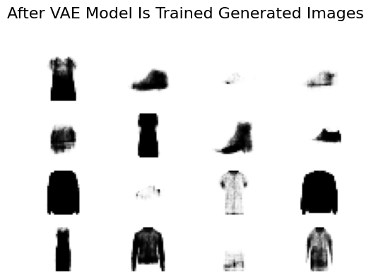
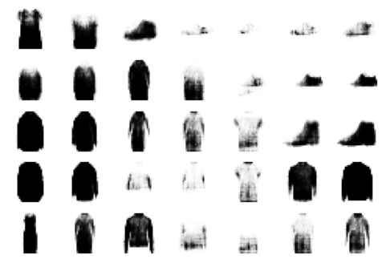
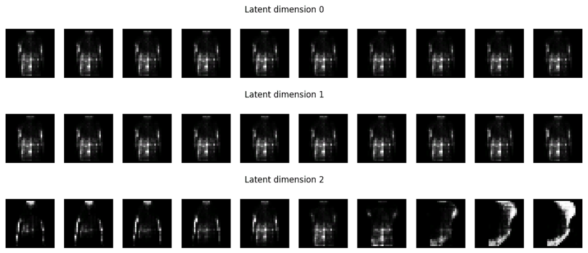
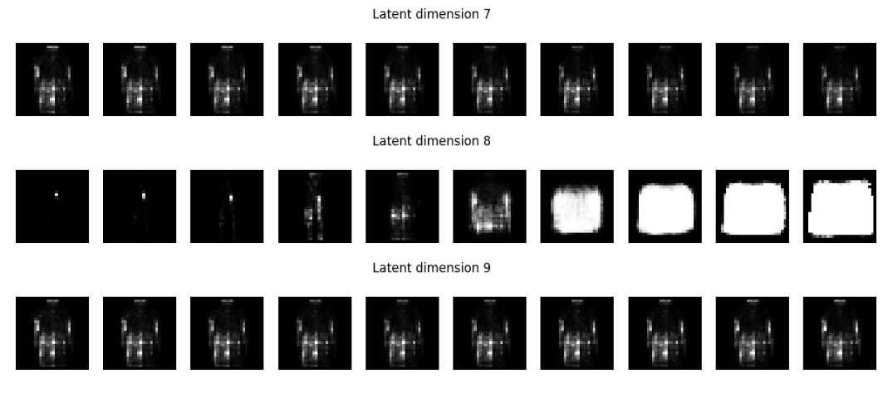
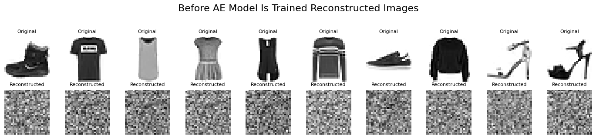
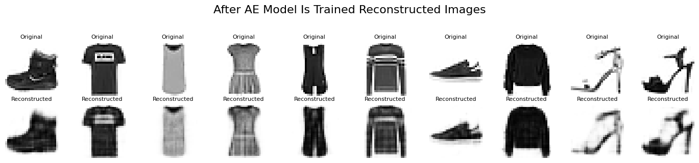

# Fashion MNIST VAE & AE Demo 

This project explores **Autoencoders (AE)** and **Variational Autoencoders (VAE)** using **fully-connected (dense)**
layers applied to the **Fashion MNIST** dataset. We compare both models on their ability to reconstruct images and
generate new samples.

---

## Motivation

Autoencoders and Variational Autoencoders are foundational tools in representation learning and generative modeling.
This project was motivated by a desire to:

- **Explore VAE architecture** without relying on convolutional layers
- **Visualize how latent spaces encode structured information**
- **Compare deterministic vs. probabilistic encoding** approaches
- **Gain intuition** on how sampling and interpolation in latent space affect outputs

Fashion MNIST provides a clean and interpretable dataset for visual evaluation of model performance.

---

## Project Overview

| Feature      | Autoencoder (AE)                     | Variational Autoencoder (VAE)         |
|--------------|--------------------------------------|---------------------------------------|
| Type         | Deterministic                        | Probabilistic / Generative            |
| Latent Space | Fixed encodings                      | Disentangled & sampled                |
| Output       | Reconstructed input                  | Reconstructed + new generations       |

---

## Models

### Autoencoder (AE)
- Simple dense encoder-decoder
- Learns latent features for input reconstruction
- Uses `MeanSquaredError`


### Variational Autoencoder (VAE)
- Learns **distribution over latent space**
- Enables sampling and generation of new images
- Uses custom loss: `reconstruction + KL divergence`

---

##  Project Structure

```bash

    fashion-mnist-vae-Vs-ae-demo/
        │
        ├── model.py # AE and VAE model definitions
        ├── utils.py # Training, loss, plotting functions
        ├── demo_script.py # Main training script
        ├── demo.ipynb # Jupyter notebook version
        ├── requirements.txt # Dependencies
        ├── README.md # This file
        └── images/ # (Optional) Plots and generated outputs
```
---


## Getting Started

### Requirements

```bash
 Install dependencies with:

    pip install -r requirements.txt
    
```
 ### Running the Demo:
 ```bash
     python demo_script.py
     jupyter notebook demo.ipynb
     
```
---

## Training Summary

Below we show images generated by each model after training

### VAE Generation (Before vs After Training)

---




---

### Latent Space Interpolation

Interpolate over the latent space and generate a grid of images using VAE decoder

---

---

### Observe What Each Lantent Variable Controls

---




---

### AE Reconstruction (Before vs After Training)

---



---
## Conclusion

This project demonstrates the core differences and capabilities of Autoencoders and Variational Autoencoders:

- The **AE** effectively compresses and reconstructs images but cannot generate new samples or explore variability.
- The **VAE** models a distribution over the latent space, allowing:
  - Generation of realistic samples
  - Smooth interpolation between features
  - Disentanglement of latent variables

Despite using only **fully-connected (dense)** layers (no CNNs), both models were able to learn meaningful structure
from Fashion MNIST images.

**Key Takeaway:** VAEs are a powerful tool for both dimensionality reduction and generative tasks — even in simple form.

This project serves as a launching point for further exploration into:
- Convolutional VAEs
- Conditional VAEs
- Style transfer & data generation

---
