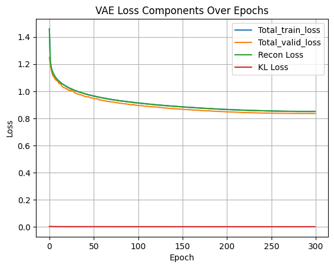
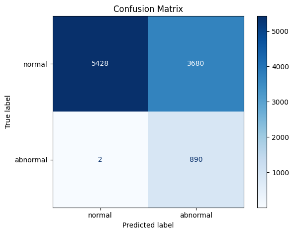
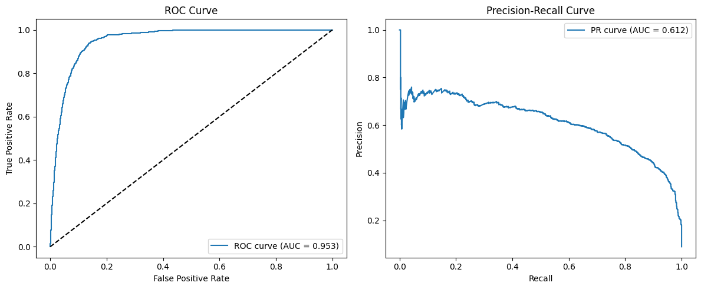
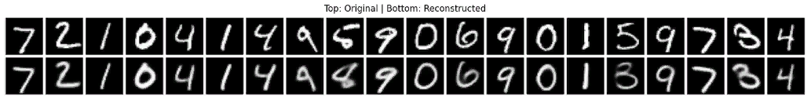
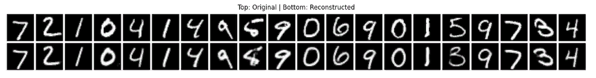
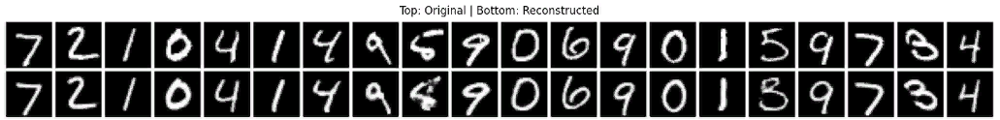
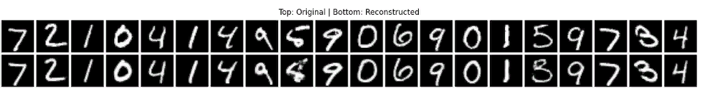
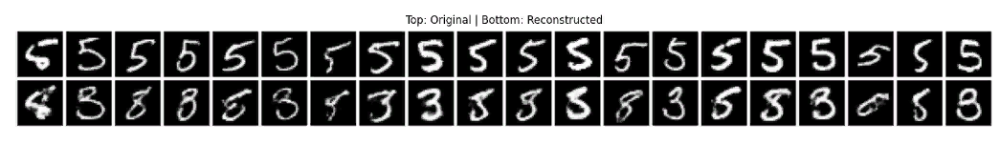
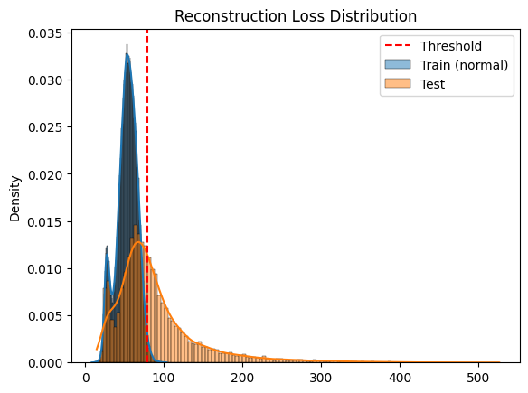

# Variational Autoencoder for Anomaly Detection (MNIST)

This project implements a Variational Autoencoder (VAE) for **unsupervised anomaly detection** using
the MNIST dataset. We train the VAE on digits **0–9 excluding digit 5**, and treat digit **5 as the
anomaly**. The model is trained to reconstruct only the "normal" digits, and detects anomalies based
on high reconstruction error at test time.The model reliably reconstructs normal samples while flagging
anomalies based on reconstruction loss. Trained with KL annealing, cosine LR decay, and gradient clipping. Final model
detects 890/892 anomalies with only 2 false negatives over 300 epochs.

This method is well-suited for scenarios where anomalies are rare or unlabeled during training.

---

## Key Features

- Trained only on normal digits (excluding digit 5)
- Digit **5** treated as anomaly during evaluation
- Achieves over **99.7% anomaly recall** with minimal false negatives
- KL divergence annealing and cosine learning rate scheduling
- Visualization tools: Confusion Matrix, ROC, and PR curves

---

## Final Evaluation Results

| Metric                  | Value         |
|-------------------------|---------------|
| True Positives (TP)     | 890 / 892     |
| True Negatives (TN)     | 5428          |
| False Negatives (FN)    | 2             |
| False Positives (FP)    | Low           |
| Anomaly Detection Recall| > 99.7%       |

---

## Model Overview

- **Architecture**: Convolutional encoder-decoder VAE
- **Latent dimension**: 10
- **Loss Function**:
  - Binary Cross-Entropy or MSE for reconstruction loss
  - KL Divergence with optional warm-up beta annealing
- **Anomaly Score**: Sample-wise reconstruction loss
- **Thresholding**: Flag samples as anomalous if their reconstruction error exceeds a chosen threshold

---

## Training Observations & Tips

The model's strong anomaly detection performance was consistent **only under the following conditions**:

- `encoding_size = 10`: Lower or higher dimensions underperformed
- `beta ≈ 0`: The KL term had to be minimized; increasing beta degraded reconstruction quality
- `learning_rate = 1e-3`: The model was extremely sensitive to learning rate; other values caused poor convergence
- **Dropout and BatchNorm only in the encoder**: Including dropout in the decoder hurt reconstruction
- **CosineAnnealingLR** helped improve convergence and reduce loss saturation, particularly in the first 50–100 epochs
- **No weight decay or L2 regularization** was used

These empirical findings were critical to training a successful anomaly detector.

---

##  Project Structure

```bash

    fashion-mnist-vae-Vs-ae-demo/
        │
        ├── model.py             # VAE model definitions
        ├── utils.py             # Training, loss, plotting functions etc..
        ├── demo_script.py       # Main training script
        ├── demo.ipynb           # Jupyter notebook version
        ├── requirements.txt     # Dependencies
        ├── README.md            # This file
        
```
---

## Getting Started

### Requirements

```bash
 Install dependencies with:

    pip install -r requirements.txt
    
```
 ### Running the Demo:
 ```bash
     python demo_script.py
     jupyter notebook demo.ipynb
     
```
---

# Training Summary

The model is trained for 300 epochs on the MNIST training set (excluding digit 5). Below are key excerpts
from the training log:

| Epoch | Train Loss | Val Loss | Grad Norm | Time (min) |
|-------|------------|----------|-----------|------------|
| 1     | 1.4598     | 1.2493   | 44.8580   | 0.171      |
| 51    | 0.9645     | 0.9446   | 9.6819    | 8.656      |
| 101   | 0.9133     | 0.8941   | 11.3163   | 8.625      |
| 151   | 0.8844     | 0.8663   | 10.3302   | 8.640      |
| 201   | 0.8653     | 0.8476   | 12.3472   | 8.511      |
| 251   | 0.8542     | 0.8378   | 16.7700   | 8.445      |
| 300   | 0.8508     | 0.8350   | 16.6365   | 8.226      |

---



---

### Confusion Matrix

---



---

### ROC and Precision Curves

---



---

### Image Reconstruction During Training At Epochs 1, 50, 250, and 300

Notice how the model consistently struggles to reconstruct digit 5, indicating effective anomaly
detection.

---

  
  
  


---

### Image Reconstruction of Only Digit 5 After Training

---



---


### Reconstruction Loss Distrbution For Train and Test Set

This histogram compares the distribution of reconstruction losses between normal training data and
the test set (which includes anomalies). A kernel density estimate (KDE) is used to highlight the
shape of each distribution. The vertical red dashed line marks the threshold used for anomaly detection.
Loss values beyond this threshold are considered anomalous. Notice how most test anomalies fall to the
right of the threshold, indicating effective separation.


---



---


## Conclusion

This project demonstrates the effectiveness of a Variational Autoencoder (VAE) for anomaly detection
on the MNIST dataset, specifically treating digit '5' as anomalous. After extensive experimentation
with architectural configurations and training strategies, the model achieved near-perfect anomaly
detection, correctly identifying 890 out of 892 anomalies and 5,428 normal samples after 300 epochs.

Key factors contributing to this performance include:

    . Latent size of 10
    . Low or near-zero KL divergence weight (β ≈ 0)
    . Learning rate of 1e-3 with Adam optimizer
    . Dropout and BatchNorm in encoder only
    . No dropout in decoder
    . CosineAnnealingLR scheduler

These conditions helped the model balance reconstruction accuracy and latent space regularization.
The result is a lightweight, robust anomaly detector capable of distinguishing subtle variations in
input data — making it an excellent candidate for use cases in outlier detection, fraud detection,
and monitoring systems.

